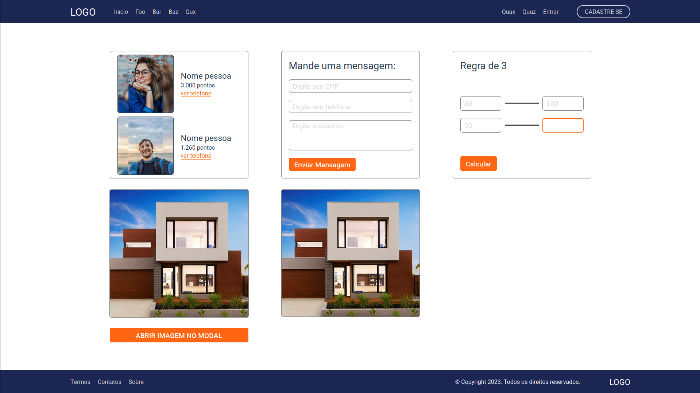

# exemplo-website-1
Exemplo de website focado em responsividade. Foi utilizado Flexbox, grid e as bibliotecas html2canvas e JQuery Mask.

[Acesse-o aqui](https://eduug.github.io/exemplo-website-1/)

